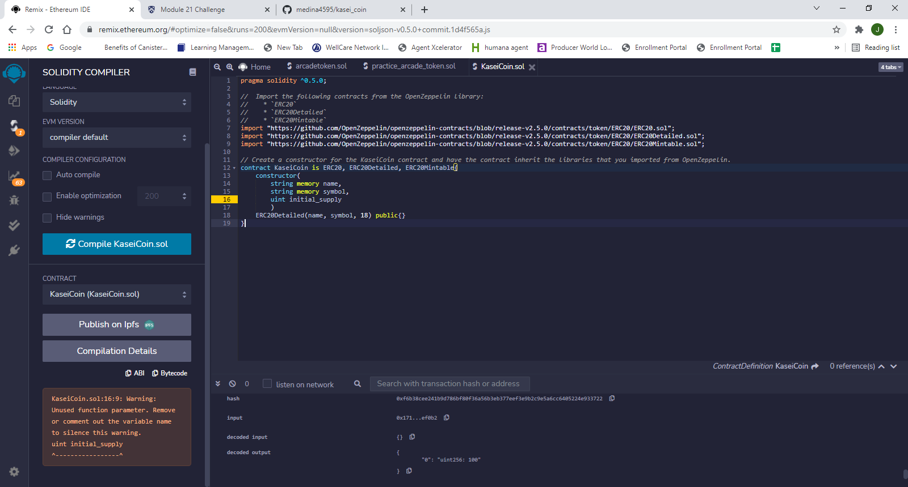
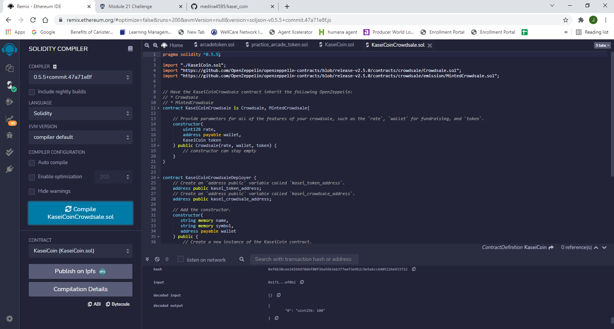
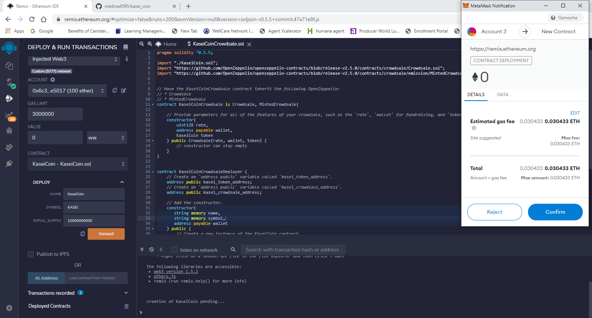
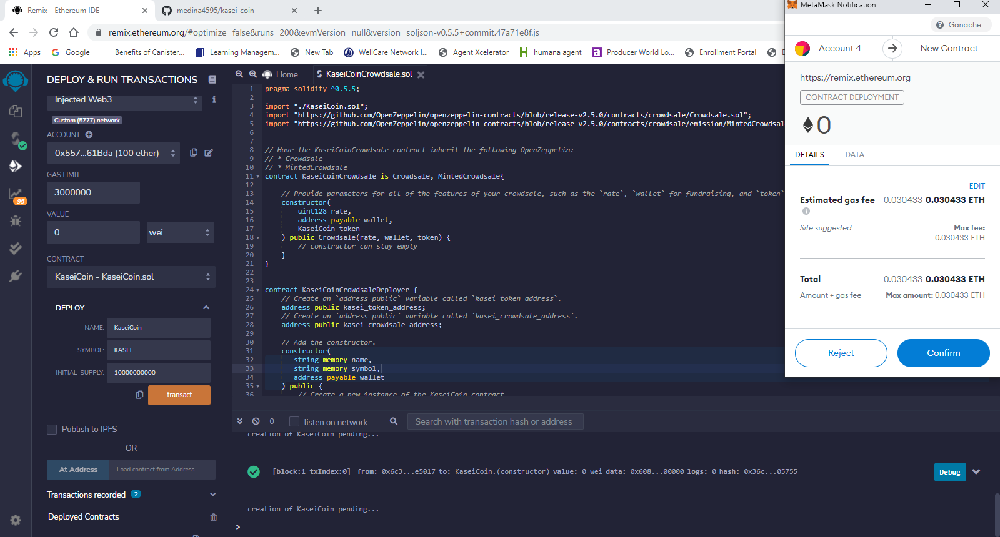
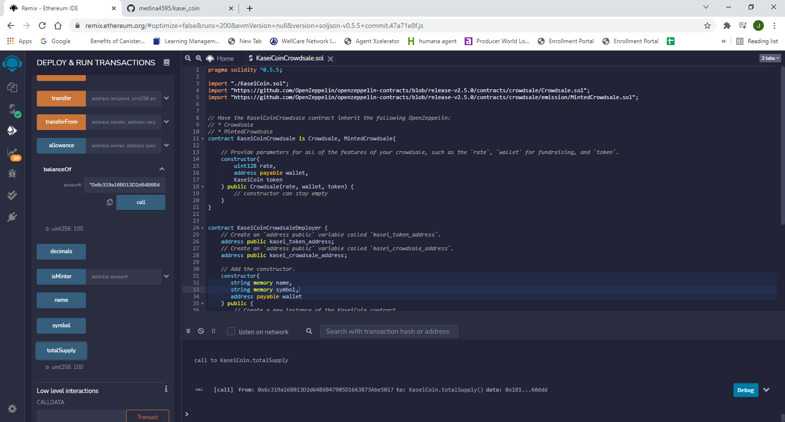

# Kasei Coin Crowdsale

This fungible ERC-20 compliant token uses the Crowdsale contract from OpenZeppelin's solidity library

## Installation Guide

1.If you want to test contract make sure to have MetaMask and Ganache downloaded to do so follow steps below:

  1.For Ganache follow the installation steps found here https://trufflesuite.com/ganache/

  2.For MetaMask follow the installation steps found here https://metamask.io/download/

2.Afterwards make sure to compile both kaseicoin.sol and kaseicoincrowdsale.sol files and deploy the kaseicoincrowdsale.sol file
  1.Make sure to deploy the file to your local ganache blockchain by changing the environment in the deploy section to 'injected web3'

## Screenshots of creating token and deployment
Creating kasaicoin contract

Creating kaseicoincrowdsale contract

deployment proof

